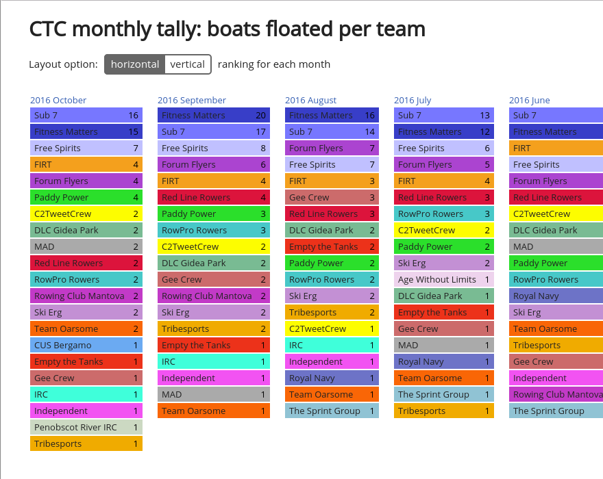
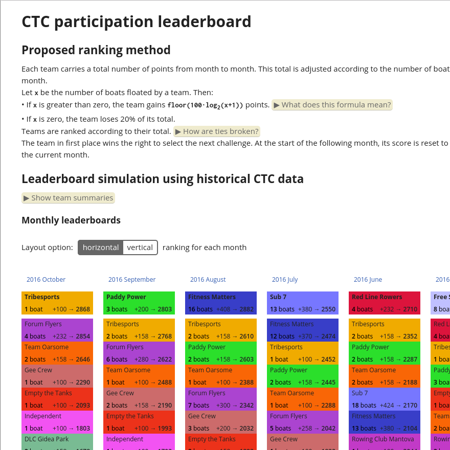

# CTC tools

## Tools for extracting and analyzing data from c2ctc.com

The Cross-Team Challenge, or CTC, is a competitive league formed by
teams of indoor rowers. Indoor rowing is also known as erging after the
[Concept 2 rowing ergometer](http://www.concept2.com/indoor-rowers),
the exercise machine that is used in this sport.

This repository contains web-scraping and number-crunching scripts that
extract information from the [CTC website](http://c2ctc.com/).

Two visualizations are offered:
- `tally.html`: a monthly ranking of teams by number of boats floated
- `scoring.html`: a proposed method of choosing the team that gets to set the challenge each month

## Monthly boat tally

## Leaderboard proposal

